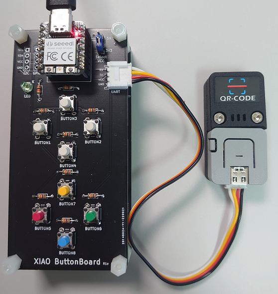

# XIAO ButtonBoard + M5Stack ATOMIC QR-CODE READER

### スキャンした結果をButtonBoard経由で送信する。
- ButtonBoardとATOMIC QR-CODE READERをGROVEケーブルで接続
- ATOMIC QR-CODE READERのボタンを押してスキャン

### 接続した。

### 動作確認する。
- QRコードをスキャンすると、読み取られた文字がテキストエディタに打ち込まれた。
- 正しく動作しているらしい。